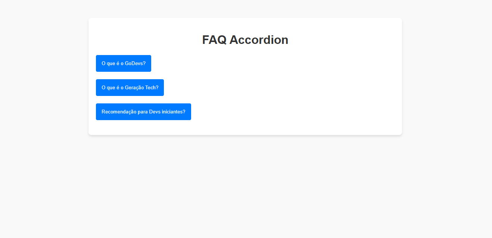
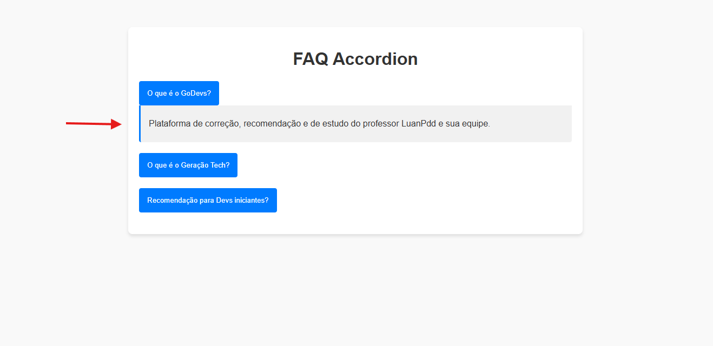
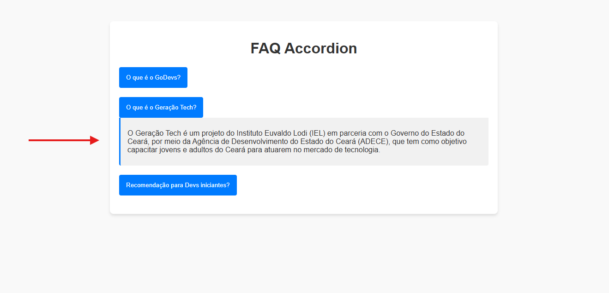
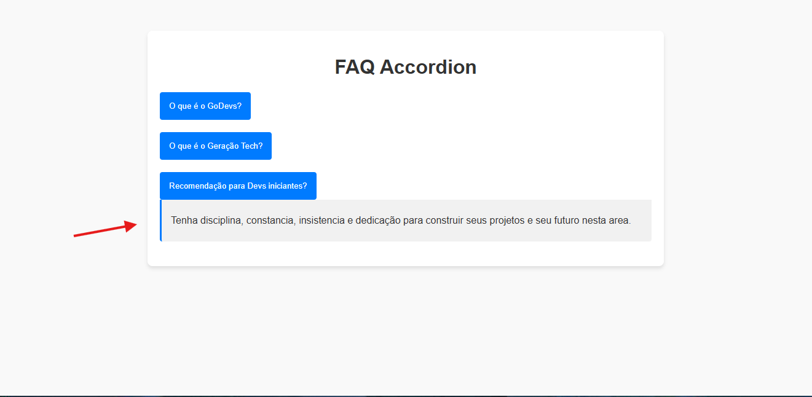

# FAQ Accordion (Perguntas Frequentes)


## 📄 Descrição

Projeto de FAQ Accordion (Perguntas Frequentes) desenvolvido para facilitar a visualização de dúvidas comuns de forma interativa e organizada. O layout é moderno, responsivo e fácil de integrar em qualquer site.

## 🖼️ Capturas de Tela

<div align="center">
  
  
  
  
</div>

## ⚙️ Requisitos

- Navegador moderno (Chrome, Firefox, Edge, Safari)
- Nenhuma dependência externa necessária

## 🚀 Como usar

1. Clone o repositório:
   ```bash
   git clone https://github.com/SEU_USUARIO/SEU_REPOSITORIO.git
   ```
2. Abra o arquivo `index.html` em seu navegador.

## 📁 Estrutura de Pastas

```
index.html
assets/
  image1.png
  image2.png
  image3.png
  image4.png
css/
  style.css
js/
  script.js
```

## 👨‍💻 Desenvolvedor

**Guilherme Queiroz (Guielihan)**

<div style="display: flex; gap: 10px; flex-wrap: wrap;">
  <a href="https://discord.com/users/1297971679737413632">
    
  </a>
  <a href="https://www.instagram.com/devguielihan/">
    
  </a>
  <a href="mailto:devguielihan@gmail.com">
    
  </a>
</div>

### 🎓 Agradecimentos e Referências

<div style="display: flex; gap: 10px; flex-wrap: wrap;">
  <a href="https://github.com/in100tiva">
    
  </a>
  <a href="https://godevs.in100tiva.com/">
    
  </a>
</div>

---

<p align="center">
  Feito com 💙 por Guielihan
</p>